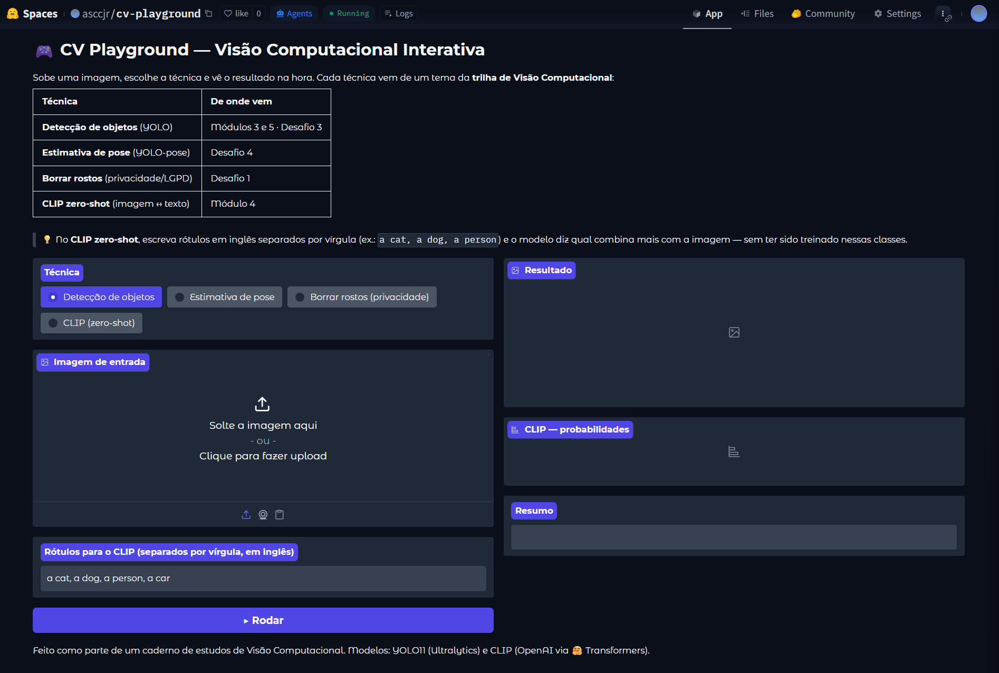
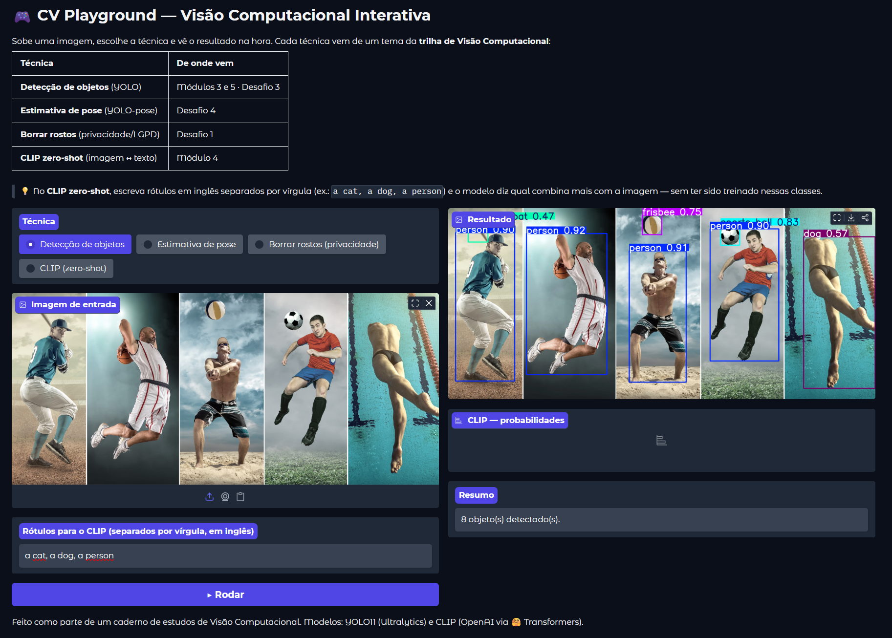
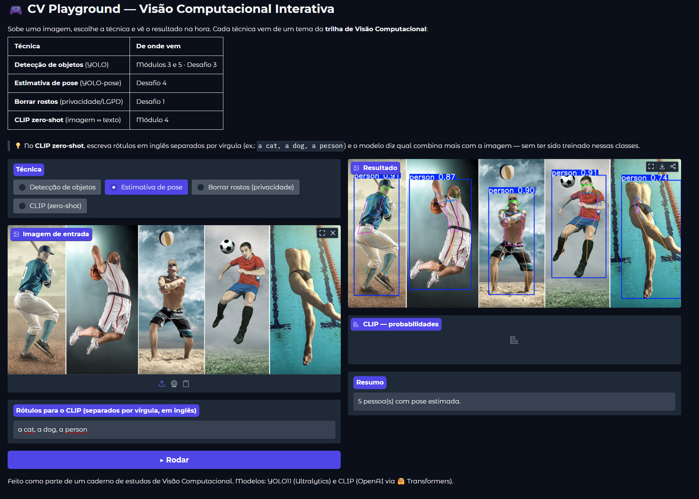
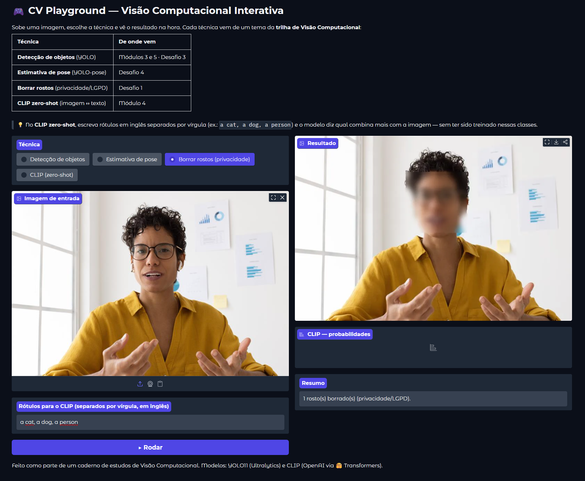
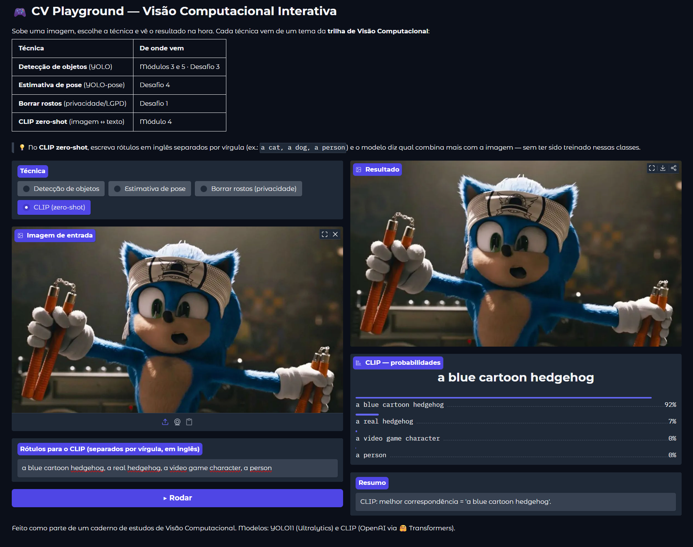

<div align="center">

# 🦔 Caderno de Visão Computacional

### Uma trilha completa de Visão Computacional — revisada, resolvida e turbinada com o Time Sonic

&nbsp;&nbsp;&nbsp;


</div>

> Caderno de estudos da minha trilha de **Visão Computacional**: os 30 notebooks de aula (Módulos 1–6)
> foram **revisados e corrigidos**, os **4 desafios** do curso foram **resolvidos do zero**, e por cima
> disso construí um **projeto de negócio (capstone)** e um **app interativo**. Tudo roda no Google Colab
> e — pra deixar o estudo mais divertido — usa o **Sonic e sua turma** como cobaias. 🦔

---

## 🎮 Demo ao vivo — CV Playground

Um app interativo: **sobe uma imagem, escolhe a técnica e vê o resultado na hora.** Reúne 4 temas do
curso (detecção, pose, anonimização e CLIP zero-shot) numa interface só.

<div align="center">

### 👉 [**Abrir o app no Hugging Face Spaces**](https://huggingface.co/spaces/asccjr/cv-playground) 👈



<table>
  <tr>
    <td align="center"><br/><sub>Detecção de objetos (YOLO11)</sub></td>
    <td align="center"><br/><sub>Estimativa de pose (YOLO11-pose)</sub></td>
  </tr>
  <tr>
    <td align="center"><br/><sub>Borrar rostos / privacidade (LGPD)</sub></td>
    <td align="center"><br/><sub>CLIP zero-shot: "a blue cartoon hedgehog" 🦔</sub></td>
  </tr>
</table>

</div>

> Código do app em [`cv_playground_app/`](cv_playground_app/).

---

## 📚 Conteúdo da trilha

### Módulos (30 notebooks de aula)

| # | Módulo | Assuntos |
|:-:|--------|----------|
| **M1** | Programação aplicada a VC | NumPy, OpenCV, visualização, operações em imagens, **filtros & convoluções** |
| **M2** | Aprendizagem de Máquina | features (SIFT/ORB), matching, classificadores (KNN/SVM/árvores), métricas, **MLP/CNNs**, modelos pré-treinados |
| **M3** | Redes Neurais Convolucionais | **transfer learning**, detecção de objetos (YOLO), segmentação (SAM/DeepLab) |
| **M4** | Modelos Generativos | **GANs**, fundamentos multimodais (**CLIP**) |
| **M5** | Projetos Reais | 6 projetos: inspeção em esteira, OCR, UI, vigilância (vídeo 3D), texturas, faixas de pista |
| **M6** | MLOps | monitoramento de experimentos com **TensorBoard** |

### Desafios (resolvidos do zero, conferidos com o gabarito)

| # | Desafio | Técnica |
|:-:|---------|---------|
| **1** | [Blur de fundo](desafio_1_blur/) | Haar Cascade + desfoque Gaussiano |
| **2** | [Reconhecimento facial](desafio_2_face_recognition/) | SSD + OpenFace (embeddings) + SVM |
| **3** | [Rastreamento de objetos](desafio_3_object%20tracking/) | YOLO `track` (IDs persistentes) |
| **4** | [Estimativa de pose](desafio_4_pose_estimation/) | YOLO11-pose (17 keypoints) |

### 🛒 Projeto final — *Data Product* de Varejo

[`desafio_final_people_analytics/`](desafio_final_people_analytics/) — **People Analytics (Footfall & Conversão).**
Transforma um vídeo de câmera em **dado de negócio**:

> **pixels → tabela de fatos (CSV) → KPIs → dashboard → decisão**

Detecta e rastreia pessoas, monta uma *fact table*, calcula KPIs (footfall, ocupação, *dwell time*,
conversão), gera um mini-dashboard e **anonimiza os rostos (LGPD)** — com uma discussão honesta sobre
qualidade de dado (*ID switch*) e o que separa o protótipo de um produto. A ponte entre Visão
Computacional e Analytics.

---

## 🦔 Sobre o tema Sonic

Pra não ficar um material seco, o curso usa o **Sonic e sua turma** (Tails, Knuckles, Amy) como imagens
de teste ao longo dos notebooks — e como ótimos exemplos de **domain shift**: modelos treinados em fotos
reais "veem" o Sonic como *teddy bear* ou simplesmente não o reconhecem. Aprender e rir ao mesmo tempo. 😄

---

## 🚀 Como rodar

Os notebooks foram feitos para o **Google Colab** e sincronizados com **[jupytext](https://jupytext.readthedocs.io/)**
(par `.ipynb` ↔ `.py`).

1. Abra o `.ipynb` desejado no Google Colab.
2. Para os notebooks que **treinam modelos** (M3–M6, alguns do M5), use **GPU**:
   *Ambiente de execução → Alterar o tipo → GPU (T4)*.
3. Faça o upload das imagens/dados indicados no início de cada notebook e rode **Run all**.

O script [`read_outputs.py`](read_outputs.py) extrai as saídas textuais dos notebooks (útil para revisão).

---

## 🗂️ Estrutura do repositório

```
.
├── Módulo 1 .. Módulo 6/         # 30 notebooks de aula (revisados)
├── desafio_1_blur/              # Desafio 1 — blur de fundo
├── desafio_2_face_recognition/  # Desafio 2 — reconhecimento facial
├── desafio_3_object tracking/   # Desafio 3 — rastreamento
├── desafio_4_pose_estimation/   # Desafio 4 — pose
├── desafio_final_people_analytics/  # Capstone — data product de varejo
├── cv_playground_app/           # App interativo (Gradio / HF Spaces)
├── img/                         # imagens do Time Sonic
├── assets/                      # screenshots e mídia do README
└── read_outputs.py              # utilitário de leitura de outputs
```

---

## 🛠️ Stack

**Python** · **OpenCV** · **NumPy** · **PyTorch / torchvision** · **scikit-learn** · **Ultralytics YOLO11** ·
**Hugging Face Transformers (CLIP)** · **EasyOCR** · **TensorBoard** · **Gradio** · **pandas / matplotlib**

---

## 🤖 Uso de IA

-D97757?logo=anthropic&logoColor=white)

Este caderno foi construído em um fluxo transparente de colaboração com IA (um assistente de programação — o Claude, da Anthropic).

---

<div align="center">

📓 Caderno de estudos pessoal · Licença [MIT](LICENSE)

</div>
